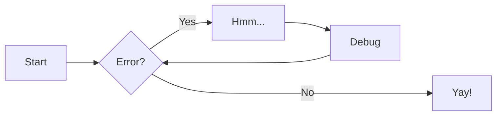

# Welcome

Welcome to my central knowledge base! This site serves as the definitive source for my documentation, references, and system configurations.

<br> <br> <br> <br> <br> <br> <br> <br> <br> <br> <br> <br> <br> <br> <br> <br> <br> <br> <br> <br> <br> <br> <br> <br> <br> <br> <br> <br> <br> <br> <br>

## Quick Zensical Reference

### Admonitions

> Go to [documentation](https://zensical.org/docs/authoring/admonitions/)

#### General Info

!!! note

    Provide helpful, persistent information that doesn't necessarily belong in the main text.

!!! info

    Highlighting facts or additional context that adds value to the reader.

!!! tip

    Pro-tips, shortcuts, or clever ways to achieve a goal.

!!! question

    FAQs, things to consider, or when prompting the user for input.

#### Validation

!!! success

    Indicate a completed task, a positive outcome, or a "correct" state.

!!! example

    Concrete illustrations or code snippets that clarify a concept.

!!! abstract

    Summaries, TL;DRs, or an overview of the content to follow.

!!! quote

    Citations, testimonials, or highlighting a specific statement.

#### Warnings

!!! warning

    Proceed with caution.

!!! failure

    Indicate something went wrong, an operation failed, or a negative outcome occurred.

!!! bug

    Document known issues, edge cases, or errors in software/logic.

!!! danger

    Critical warnings where data loss, security risks, or hardware damage might occur.

### Details

> Go to [documentation](https://zensical.org/docs/authoring/admonitions/#collapsible-blocks)

??? info "Click to expand for more info"

    This content is hidden until you click to expand it.
    Great for FAQs or long explanations.

### Code Blocks

> Go to [documentation](https://zensical.org/docs/authoring/code-blocks/)

```python hl_lines="2" title="Code blocks"
def greet(name):
    print(f"Hello, {name}!") # (1)!

greet("Python")
```

1.  > Go to [documentation](https://zensical.org/docs/authoring/code-blocks/#code-annotations)

    Code annotations allow to attach notes to lines of code.

Code can also be highlighted inline: `#!python print("Hello, Python!")`.

### Content tabs

> Go to [documentation](https://zensical.org/docs/authoring/content-tabs/)

=== "Python"

    ``` python
    print("Hello from Python!")
    ```

=== "Rust"

    ``` rs
    println!("Hello from Rust!");
    ```

### Diagrams

> Go to [documentation](https://zensical.org/docs/authoring/diagrams/)



### Footnotes

> Go to [documentation](https://zensical.org/docs/authoring/footnotes/)

Here's a sentence with a footnote.[^1]

Hover it, to see a tooltip.

[^1]: This is the footnote.

### Formatting

> Go to [documentation](https://zensical.org/docs/authoring/formatting/)

- ==This was marked (highlight)==
- ^^This was inserted (underline)^^
- ~~This was deleted (strikethrough)~~
- H~2~O
- A^T^A
- ++ctrl+alt+del++

### Icons, Emojis

> Go to [documentation](https://zensical.org/docs/authoring/icons-emojis/)

- :sparkles: `:sparkles:`
- :rocket: `:rocket:`
- :tada: `:tada:`
- :memo: `:memo:`
- :eyes: `:eyes:`

### Maths

> Go to [documentation](https://zensical.org/docs/authoring/math/)

$$
\cos x=\sum_{k=0}^{\infty}\frac{(-1)^k}{(2k)!}x^{2k}
$$

!!! warning "Needs configuration"
Note that MathJax is included via a `script` tag on this page and is not
configured in the generated default configuration to avoid including it
in a pages that do not need it. See the documentation for details on how
to configure it on all your pages if they are more Maths-heavy than these
simple starter pages.

<script id="MathJax-script" src="https://unpkg.com/mathjax@3/es5/tex-mml-chtml.js"></script>
<script>
  window.MathJax = {
    tex: {
      inlineMath: [["\\(", "\\)"]],
      displayMath: [["\\[", "\\]"]],
      processEscapes: true,
      processEnvironments: true
    },
    options: {
      ignoreHtmlClass: ".*|",
      processHtmlClass: "arithmatex"
    }
  };

  document$.subscribe(() => {
    MathJax.startup.output.clearCache()
    MathJax.typesetClear()
    MathJax.texReset()
    MathJax.typesetPromise()
  })
</script>

### Task Lists

> Go to [documentation](https://zensical.org/docs/authoring/lists/#using-task-lists)

- [x] Install Zensical
- [x] Configure `zensical.toml`
- [x] Write amazing documentation
- [ ] Deploy anywhere

### Tooltips

> Go to [documentation](https://zensical.org/docs/authoring/tooltips/)

[Hover me][example]

[example]: https://example.com "I'm a tooltip!"
